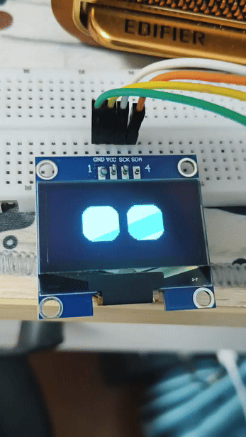
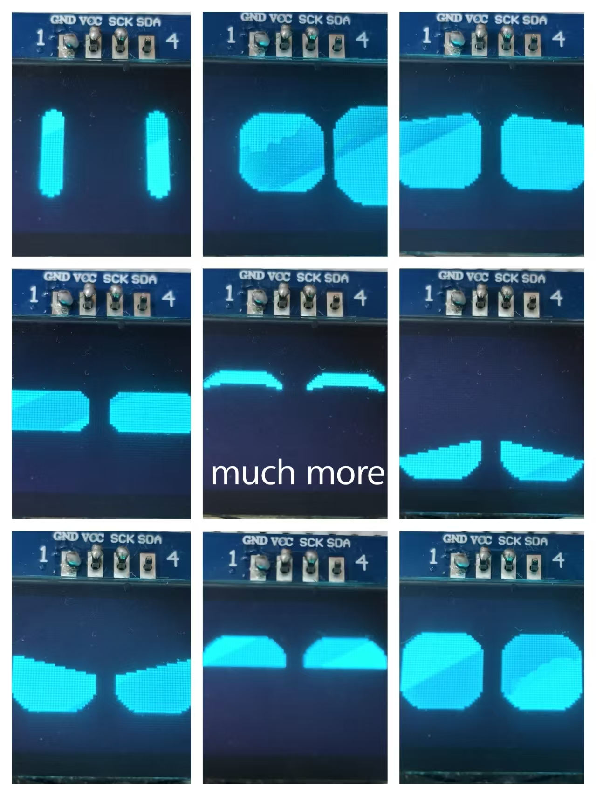

# RobotEye

A pure-vector animated robot eye library for monochrome OLED displays, built on top of [U8g2](https://github.com/olikraus/u8g2).

Unlike bitmap-based eye libraries that swap pre-rendered frames, RobotEye describes every expression as a set of geometric parameters (rounded rectangle + cuts + slopes + ellipse mask). Any two expressions can be linearly interpolated, so transitions are always smooth — no frame-by-frame animation required.

---

## Features

Expression switching methods:
- 1. Smooth Morph transition — all parameters interpolate linearly with ease-in-out over 500ms (configurable)
- 2. Blink switch — close eyes → swap → fade in new expression while opening

- Pure vector rendering — 24 eye expressions drawn from geometry, no bitmap assets required (bitmap assets can also be imported)
- Non-blocking — state-machine driven, no `delay()`
- Boot animation — closed → half-open → 3 blinks → fully open (optional, can be disabled)
- Idle liveliness — automatic blinking, random glancing (auto-return), half-blink squint, subtle position drift
- 5 special expressions — vector battery gauge (adjustable level) + 4 optional Irisoled bitmaps
- 8 user slots — register custom expression generators via function pointer (built-in expressions can also be replaced)
- Screen auto-detection — reads actual width/height from U8g2, auto-centers eyes, supports 4-direction fine tuning
- Dual buffer modes — full framebuffer (fast, 1024B RAM) or page buffer (128B RAM, for low-RAM MCUs)
- Cross-platform — works on major platforms such as ESP, STM32, AVR
- Extensive parameter tuning — all tunable parameters are `static constexpr` inside the class, plus a small number of macros

---




## Quick Start

```cpp
#include <U8g2lib.h>
#include <RobotEye.h>

U8G2_SH1106_128X64_NONAME_F_HW_I2C u8g2(U8G2_R0, U8X8_PIN_NONE);
RobotEye eye(&u8g2);

void setup() {
    u8g2.begin();
    eye.begin();          // auto seed, auto screen size
}

void loop() {
    eye.update();         // call every frame, do not use delay()
}
```

After boot, the eyes enter NORMAL idle and run all automatic animations. Switch expressions anytime:

```cpp
eye.setExpression(RobotEye::EXPR_HAPPY);           // smooth morph
eye.setExpression(RobotEye::EXPR_ANGRY, true);     // blink-switch
eye.setExpression(RobotEye::EXPR_BATTERY);
eye.setBatteryLevel(75);
```

---

## Documentation

| File | Description |
|------|-------------|
| [Getting Started](docs/getting-started.md) | Installation, hardware setup, first program |
| [API Reference](docs/api-reference.md) | All public methods, enums, and types |
| [Expressions](docs/expressions.md) | 24 vector expressions + 5 special + 8 user slots |
| [Configuration](docs/configuration.md) | All `static constexpr` parameters and build macros |
| [Custom Expressions](docs/custom-expressions.md) | Write and register your own expression |
| [Architecture](docs/architecture.md) | Calculation/render split, state machines, interpolation |
| [FAQ](docs/faq.md) | Common questions and troubleshooting |

---



## Requirements

- **U8g2** (required) — install via Library Manager or PlatformIO (https://github.com/olikraus/u8g2)
- **Irisoled** (optional) — only needed for Warning / Left Signal / Right Signal / Mode bitmap expressions (https://github.com/orji123/Irisoled)
- A monochrome OLED supported by U8g2 (SH1106, SSD1306, etc.), I2C or SPI
---

All expression configurations can be modified within `robot_eye.hpp`. This file contains extensive inline comments for your reference.

## Acknowledgements
The design of robot eye expressions in this library is inspired by [https://github.com/orji123/Irisoled].
The original project is licensed under the MIT License, copyright (c) [2025] [orji123].
All source code of RobotEye is independently implemented.


This library is designed for lightweight use. Feedback and suggestions are welcome.
## License

MIT
